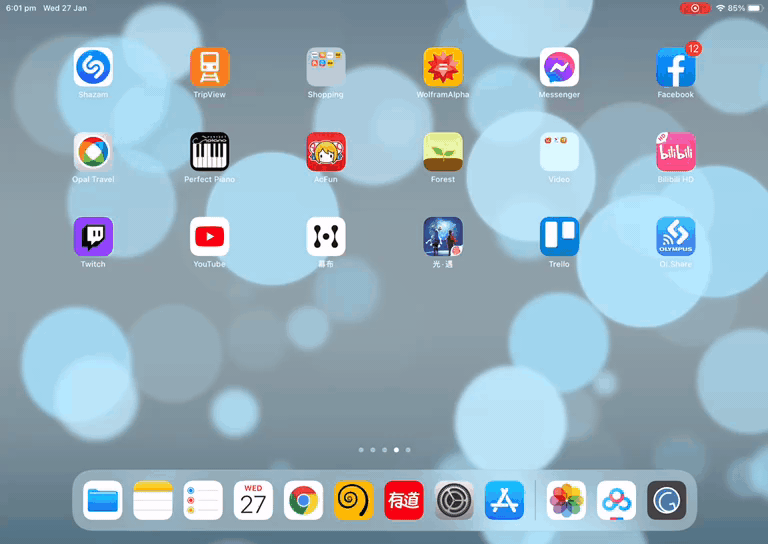

# Mobile Vim Setup
My own mobile easy-to-setup vim editor.

**The ultimate goal of this project is to create a standalone vim editor with nice plugins pre-configured and can be ready to go with one line: **

```bash
git clone https://github.com/Soooda/.vim
```

Or even on some tough environments that don't even have essential executables!

For instance, [A-Shell](https://github.com/holzschu/a-shell) on IOS:



## Plugins
Color theme [dracula](https://draculatheme.com/vim)

Cursor Highlighter Plugin [vim-illuminate](https://github.com/RRethy/vim-illuminate)

Brackets Highlighter Plugin [rainbow](https://github.com/luochen1990/rainbow)

Start-up Screen Plugin [vim-startify](https://github.com/mhinz/vim-startify)

Commenter Plugin [tcomment](https://github.com/tomtom/tcomment_vim)
